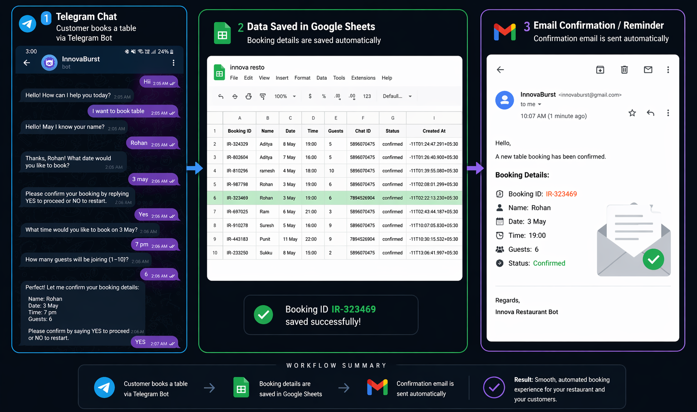
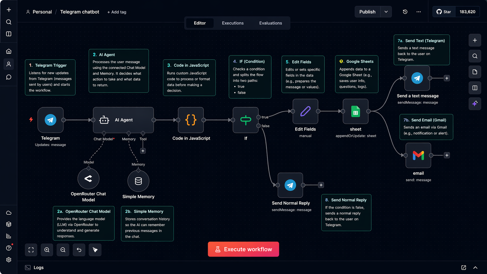
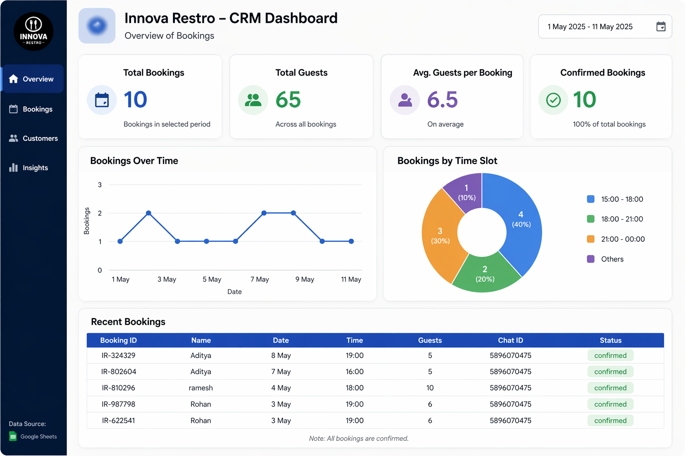

# 🍽️ Telegram Restaurant Chatbot

## 🚀 Project Overview

This project is a **Telegram-based AI chatbot** that allows users to interact with a restaurant system for queries, table reservations, and automated email notifications.

It demonstrates real-world automation by integrating **Telegram Bot API, backend workflow (n8n), and email services**.

---

## 🎯 Key Features

* 🤖 Interactive Telegram chatbot
* 📅 Table reservation system
* 📧 Automated email notifications
* 🔄 Backend workflow automation (n8n)
* 📊 Dashboard for monitoring (demo)

---

## 🧠 How It Works

1. User sends a message on Telegram
2. Bot receives and processes the input
3. Workflow automation (n8n) handles logic
4. System triggers email notification
5. Data is processed and stored/displayed

---

## 🛠️ Tech Stack

* Python
* Telegram Bot API
* n8n (Workflow Automation)
* SMTP Email Service

---

## 📸 Project Screenshots

### 🔹 Telegram Chat / User Interaction

### 🔹 Workflow Automation (n8n)

### 🔹 Backend Process

### 🔹 Dashboard View

---

## 💡 Use Case

This system can be used in:

* Restaurants for automated booking
* Customer support automation
* AI-based chatbot services
* Workflow automation systems

---

## 🔐 Security Note

Sensitive information like API keys and credentials are not included in this repository.

---

## 👨‍💻 Author

**Aditya Rajput**

## 📄 License
This project is licensed under the MIT License.

---

## ⭐ If you like this project

Give it a ⭐ on GitHub and share your feedback!
